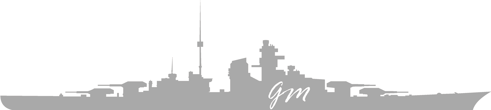

  

## Hello there 👋

I enjoy learning and building different kinds of projects. I'm into all kinds of technologies and always love to learn new things.

I've dreamed becoming a Full-Stack Developer since I was a child.
  

<h3 align="center">🧑‍🎓 I'm currently completing <a href="https://www.microverse.org/">Microverse</a> curriculum! 🎓🧑</h3>
 

## Contact 🔗:
 

- Linkedin: [Geronimo Morisot](https://linkedin.com/in/geronimomorisot)
- Portfolio: [www.geronimomorisot.me](https://geronimomorisot.me/)
- Twitter: [@GeronimoMorisot](https://twitter.com/GeronimoMorisot)
- Angel List: [Geronimo Morisot](https://angel.co/u/geronimo-morisot-morla)

## My Stack and tools :computer::

  
  &nbsp;&nbsp;&nbsp;
  &nbsp;&nbsp;&nbsp;
  &nbsp;&nbsp;&nbsp;
  &nbsp;&nbsp;&nbsp;
  &nbsp;&nbsp;&nbsp;
  &nbsp;&nbsp;&nbsp;
  &nbsp;&nbsp;&nbsp;

  
  &nbsp;&nbsp;&nbsp;
  &nbsp;&nbsp;&nbsp;
  &nbsp;&nbsp;&nbsp;
  &nbsp;&nbsp;&nbsp;
  &nbsp;&nbsp;&nbsp;
  &nbsp;&nbsp;&nbsp;
  &nbsp;&nbsp;&nbsp;

My GitHub Stats!
  

 

  
A little bit about me.

   

  - I'm from Argentina and worked most of my adult life in the Real State business. 
  Also worked attending customers in all different kinds of business.
  - I like to recognize good and bad services. Love feedback about everything, if given positively and honest, better.

  - Like I suppose everybody does I love Life in the most meaningful way of the word. I consider every little detail counts.

  - 🥁 I'm a Drummer . And I think music is essential in everyday life. I use to hear a ton of genres, mostly 🎸Heavy-Metal🎸 drove.

  - 🛰️ Big fan of Space, Astronomy and Rocketry.

  - And lastly, for a couple of years, I've been committed to introspect and add healthy improvements to my life.
    - 🏃‍♂️ Jogging/running,
    - 🏋️ home training (calisthenics),
    - 🚭 no smoking,
    - 🍒 and eating healthy.

  
Why Bismarck?

   
  Because at the time of building my GitHub account I was hearing 'all day long' a song from Sabaton called Bismarck. 
  Also, I like WW2 histories and machinery created in which was the world's biggest conflict to date. And, Bismarck was a show of what we, as humans, can build. It was a real 'monster of the sea', with a ton of issues, but still managed to be an imponent piece of human-created machinery.

<h3 align="center">
   <i><strong>“it will never be perfect. make it work” -- life</strong></i>
    
    
</h3>	
